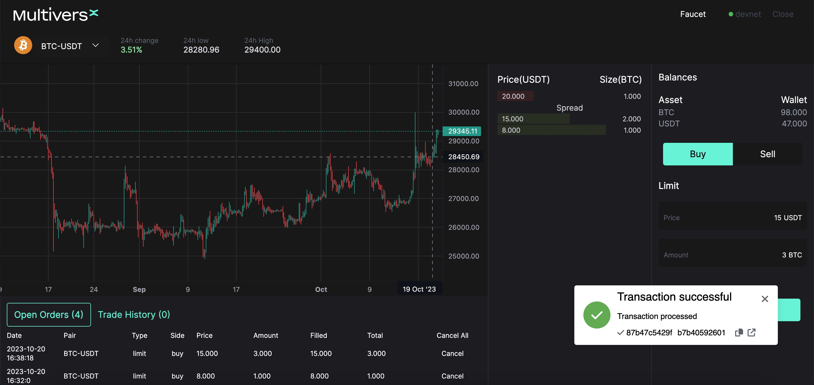

# Multiversx-orderbook 
A limit orderbook dex built on multiversx

# Introduction

 Multiversx orderbook is limit ordebook dex built on Multiversx blockchain.
 By operating on a decentralized Multiversx network, the  Multiversx orderbook  promotes decentralization, eliminating the need for a central authorit, no cenerliazd fund custody, no KYC, fully decentralized. The use of blockchain technology ensures transparency, as the order book and trade history can be publicly audited and verified.

 
 # Components
- Frontend 
    
    Frontend is the first place user to interact with the DEX. Provides a simple method for 
    traders to create and submit orders, allowing a trader to request an amount of token they wish to buy or sell, and a price point, and whether they want a limit or market order 
        
- Limit Orderbook Contract

    The on-chain smart contract is responsible for matching and verifying the order submitted by the off-chain engine as well as transfer respective assets between the trading parties.

    The smart contracts on the blockchain make sure the  secure and transparent transactions.
     
- Matching Engine
    Key features and functionalities of a decentralized order book engine include:

    Order Book Management: It maintains an order book that contains buy and sell orders arranged based on price and time priority. The order book records all outstanding orders for a trading pair, including information such as price, quantity, and submission time.

    Matching Engine: The order book engine is responsible for matching buy and sell orders, finding order pairs that match in price and quantity, and executing trades. The matching rules can be configured based on the exchange's requirements, such as choosing price or time priority for matching.

    Trade Execution: Once a matching pair is found, the order book engine submits the trade to on-chain smart for order execution.

    Real-time Updates: The order book engine continuously updates the order book in real-time as new orders are placed, executed, or canceled. This allows traders to see the latest order book status and make informed trading decisions.

## Project Setup 
### Compile and Deploy Contracts 
- cd contract
- npm && npm build
- ./deploy.js

### Dapp
- cd dapp
- yarn 
- yarn start-devnet

### Engine
- cd engine
- go mod tidy && bo build 
- ./engine
 

### Built With

* Golang 
* React
* Rust

 